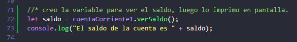

# JavaScript Orientación a objetos

## Clases

Inicia con una explicación de porque las variables no son la mejor opción para trabajar con muchos registros y como una 
clase puede ser un molde para agrupar esos registros o datos de clientes de un banco.

Creo la clase y debajo una instancia de la misma:

Accedo a la propiedad nombre del objeto cliente1 y la modifico.

Ahora puedo acceder al objeto o instancia completo.

Lo que aprendimos en esta aula:

* Creación de clases
* Qué son los atributos/propiedades de una clase
* Instancia/Objeto de una clase
* Palabras reservadas class y new

### Clase 02 

#### Métodos

Dentro de las clases puedo agregar comportamientos en el ejemplo se suman los depósitos al saldo.

Uso la palabra reservada `.this` refiere a que los cambios son al objeto que estoy referenciando el actual en este ejemplo
es la `cuentaCorriente1`.
Para utilizar el método lo llamo con la siguiente sintaxis:

Resultado: 

### Atributos privados #1

    /**
     * The constructor function is a special function that is called when an object is created from a
     * class.
     */
    constructor() {
        this.numero = '';
        this.saldo = 0;
        this.agencia = '';
    }

Para que los valores no inicializados No den errores como NAN los defino como vacíos en el constructor y eso pasa a ser su 
inicialización.

### Atributos privados #2 Encapsulamiento

Por convención todavía no es oficial anteponiendo él `#` a la variable convierto un atributo en privado y solo es visible 
y operable dentro de la función. NOTA si utilizo `_` le digo al programador que lo trate como privado, pero NODEJS 
lo ejecuta igual.

https://developer.mozilla.org/en-US/docs/Web/JavaScript/Reference/Classes/Private_class_fields

### Métodos con retorno

Palabra reservada `return`

Creo la function para retorno sin romper la encapsulation

Visualizo la información

Mejoro el código

## Modularizando el código

En esta clase seccionaremos al archivo en módulos, En la carpeta aula_03 iré creando los módulos y dentro de cada uno 
pongo las clases luego para acceder desde `index.js` los debo importar.

Esta es la sintaxis 

 

 Para crear ese archivo package.json lo podemos crear de dos formas: lo podemos hacer a mano si conocemos la estructura 
 y todas las variables, o podemos hacer uso de una herramienta que nos permite utilizar Node que se llama `NPM`, 
 de **_Node Package Management_** y ejecutamos ese comando diciéndole que inicie nuestro proyecto.

Al igual que en las clases de OB inicio un paquete json con el comando `NPM init`

ahí comienzo a cargar los datos requeridos en la terminal: el nombre entre parentesis lo pone automatico por la carpeta
lo siguiente escrito en minusculas es el nombre que le dimos en esta clase.

Me pregunta si esta bien: la carpeta tenia un ascento que no lo lee -- COMPROBÉ QUE SI FUNCIONA --  me llevo al repositorio

Con todo esto todavía da error la importación, agrego `"type" : "module",` en este ejemplo lleva coma en otros no.

exporto la clase en el mod cuentaCorriente

   -- 

 -- si no exportaba los dos no funcionaba.

FUNCIONA CORRECTAMENTE.

### Composición de clases

Componer clases es unirlas de manera que trabajen juntas varias clases.

En esta clase agregamos un objeto dentro de cuenta corriente, a cliente y en el constructor lo iniciamos como `null`
para referenciarlo pero crearlo en otro lado, el módulo propio de Cliente.

Lo muestra exitosamente

#### Método para transferir
Como dice la imagen, los parámetros son el `valor` de esta cuenta por eso el uso de `.this` y el segundo es la cuenta de 
destino que luego será asignada. dentro de este método/función uso los ya creados para _retirar y depositar_.

Luego de crear la nueva cuenta y cliente "ejemplo en código" hago la transferencia e imprimo el saldo inicial y posterior

